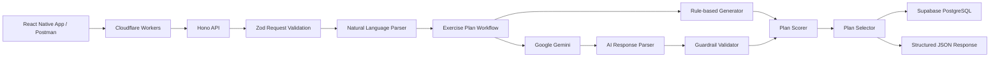
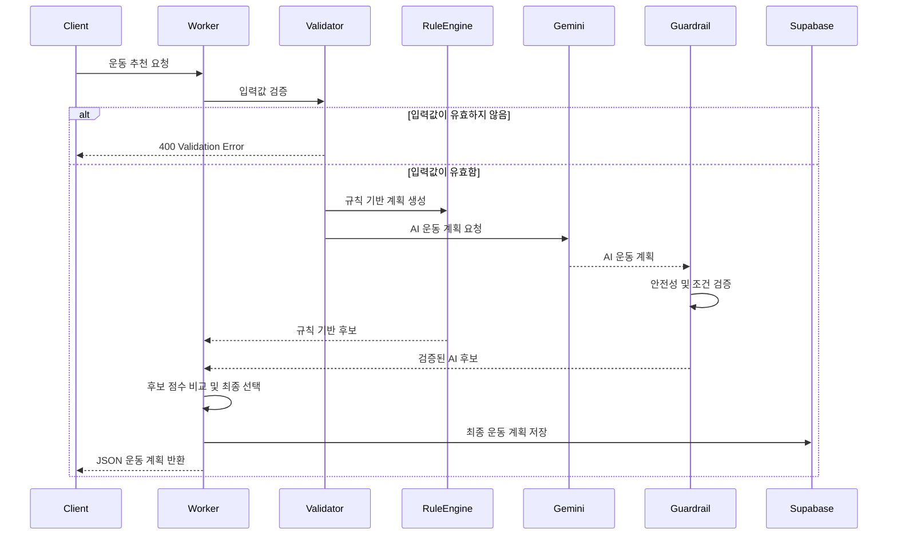

<div align="center">

# 🏋️ Exercise AI Worker

### 사용자 상태와 운동 환경을 분석해  
### 안전한 맞춤형 운동 계획을 생성하는 Serverless AI Backend

<br>


<br>

**AI Healthcare Capstone Project · Exercise Recommendation Backend**

</div>

---

## 📌 프로젝트 소개

**Exercise AI Worker**는 사용자의 신체 정보, 운동 목표, 통증 부위, 운동 장소와 사용 가능한 장비를 분석하여 개인 맞춤형 운동 계획을 생성하는 백엔드 서비스입니다.

단순히 AI가 생성한 답변을 그대로 반환하지 않고 다음 과정을 거칩니다.

1. 사용자 입력값 검증
2. 자연어 요청에서 운동 조건 추출
3. 규칙 기반 운동 계획 생성
4. Google Gemini 기반 운동 계획 생성
5. 운동 안전성 검증
6. 후보 계획 점수 계산 및 비교
7. 최종 운동 계획 선택
8. Supabase 데이터베이스 저장

AI 응답이 잘못된 형식으로 반환되거나 안전 기준을 통과하지 못하더라도, 규칙 기반 운동 계획으로 대체할 수 있도록 설계했습니다.

> 본 저장소는 AI 헬스케어 캡스톤 디자인 팀 프로젝트에서  
> 제가 담당한 **AI 운동 추천 백엔드 영역**을 포트폴리오용으로 정리한 저장소입니다.

---

## ✨ 핵심 기능

### 🤖 AI 기반 개인 맞춤 운동 추천

사용자의 다음 정보를 종합하여 운동 계획을 생성합니다.

- 나이, 성별, 키, 체중
- 운동 수준
- 운동 목표
- 건강 상태
- 통증 부위
- 주간 운동 가능 횟수
- 1회 운동 가능 시간
- 운동 장소
- 사용 가능한 운동 장비
- 선호 운동
- 제외 운동
- 자연어 추가 요청

---

### 🛡️ 운동 안전성 검증

AI가 생성한 운동 계획에 위험하거나 사용자 조건과 맞지 않는 운동이 포함되지 않았는지 검사합니다.

예를 들어 사용자가 무릎 통증을 입력한 경우 다음과 같은 고충격 운동을 제한할 수 있습니다.

- 점프 동작
- 버피 테스트
- 과도한 스쿼트 반복
- 무릎 부담이 큰 고강도 운동

검증 결과에는 다음 정보가 포함될 수 있습니다.

- 검증 통과 여부
- 경고 메시지
- 조건 위반 항목
- 운동 시간 적합성
- 사용자 제외 운동 포함 여부

> 이 서비스는 의료 진단이나 치료를 제공하지 않으며,  
> 질환 또는 심한 통증이 있는 사용자는 의료 전문가와 상담해야 합니다.

---

### ⚖️ AI와 규칙 기반 결과 비교

운동 계획을 한 가지 방식으로만 생성하지 않습니다.

```text
규칙 기반 운동 계획
        +
Gemini AI 운동 계획
        ↓
안전성 검증 및 점수 계산
        ↓
더 적합한 최종 계획 선택
```

AI 결과가 안전성 검증을 통과하지 못하거나 API 호출에 실패한 경우 규칙 기반 결과를 사용할 수 있습니다.

두 결과가 모두 유효한 경우에는 다음 항목을 기반으로 비교합니다.

- 사용자 요구사항 반영 정도
- 통증 및 건강 조건 준수 여부
- 운동 시간 적합성
- 운동 강도 적합성
- 운동 구성의 완성도
- 경고 항목 수
- 제외 운동 포함 여부

---

### 🧠 자연어 운동 요청 처리

정형화된 입력값 외에도 사용자가 작성한 자연어 요청을 운동 조건으로 활용합니다.

예시:

```text
무릎이 좋지 않아서 점프 운동은 빼고
집에서 하루 20분 정도만 운동하고 싶어요.
```

자연어 요청에서 다음과 같은 조건을 추출할 수 있습니다.

```text
통증 부위: 무릎
제외 운동: 점프 운동
운동 장소: 집
운동 시간: 20분
```

---

### 📦 구조화된 JSON 응답

React Native와 같은 클라이언트 애플리케이션에서 바로 사용할 수 있도록 운동 계획을 구조화된 JSON으로 반환합니다.

운동 계획은 다음 단계로 구분됩니다.

```text
Warm-up
   ↓
Main Exercise
   ↓
Cool-down
```

각 운동에는 다음과 같은 정보가 포함될 수 있습니다.

- 운동 이름
- 운동 설명
- 세트 수
- 반복 횟수 또는 수행 시간
- 세트 간 휴식 시간
- 운동 강도
- 주의사항
- 운동 선택 이유

---

### 💾 Supabase 결과 저장

선택된 운동 계획은 Supabase PostgreSQL에 저장할 수 있습니다.

대표적으로 다음 정보를 관리합니다.

| 필드 | 설명 |
|---|---|
| `user_id` | 사용자 식별자 |
| `onboarding_id` | 운동 설문 식별자 |
| `plan_payload` | 생성된 운동 계획 JSON |
| `model_name` | 사용한 AI 모델 |
| `prompt_version` | 프롬프트 버전 |
| `created_at` | 생성 일시 |

운동 계획 전체를 JSON 형태로 저장하여 모바일 애플리케이션과 캘린더 기능에서 재사용할 수 있도록 구성했습니다.

---

### ⚡ Serverless Backend

Cloudflare Workers를 활용하여 별도의 서버를 직접 관리하지 않고 API를 실행할 수 있도록 구성했습니다.

- 서버리스 실행 환경
- 빠른 API 응답
- 간단한 배포
- 트래픽 증가에 따른 확장성
- Hono 기반 경량 라우팅

---

## 🏗️ 시스템 아키텍처



---

## 🔄 운동 계획 생성 흐름



---

## 🧩 추천 처리 전략

### AI 사용이 비활성화된 경우

```text
사용자 입력
→ 규칙 기반 운동 계획 생성
→ 안전 조건 확인
→ 결과 반환
```

### AI 사용이 활성화된 경우

```text
사용자 입력
→ 규칙 기반 후보 생성
→ Gemini 후보 생성
→ AI 응답 구조 검증
→ 안전성 검증
→ 후보 점수 계산
→ 최종 계획 선택
→ 결과 저장 및 반환
```

### AI 호출에 실패한 경우

```text
Gemini API 오류
또는
잘못된 JSON 응답
또는
안전성 검증 실패
        ↓
규칙 기반 운동 계획으로 대체
```

이 구조를 통해 외부 AI API에 문제가 발생하더라도 기본적인 운동 추천 기능을 유지할 수 있습니다.

---

## 🛠️ 기술 스택

| 영역 | 기술 | 사용 목적 |
|---|---|---|
| Language | TypeScript | 타입 안정성을 갖춘 백엔드 개발 |
| Runtime | Cloudflare Workers | Serverless API 실행 |
| Web Framework | Hono | 경량 라우팅 및 API 구성 |
| AI | Google Gemini | 개인 맞춤 운동 계획 생성 |
| Database | Supabase PostgreSQL | 추천 결과 및 사용자 데이터 저장 |
| Validation | Zod | 요청 데이터 및 응답 구조 검증 |
| Deployment | Wrangler | 로컬 실행 및 Workers 배포 |
| Package Manager | npm | 의존성 및 스크립트 관리 |

---

## 📁 프로젝트 구조

```text
Exercise_AI_Worker/
├─ src/
│  ├─ data/
│  │  └─ 운동 생성에 사용되는 기본 데이터
│  │
│  ├─ endpoints/
│  │  └─ exercisePlanRequest.ts
│  │     └─ 운동 추천 API 요청 처리
│  │
│  ├─ parsers/
│  │  └─ 자연어 요청 및 AI 응답 파싱
│  │
│  ├─ prompts/
│  │  └─ Gemini 운동 추천 프롬프트 구성
│  │
│  ├─ schemas/
│  │  └─ Zod 기반 요청 및 응답 스키마
│  │
│  ├─ services/
│  │  ├─ exerciseGuardrailValidator.ts
│  │  │  └─ 운동 계획 안전성 검증
│  │  │
│  │  ├─ exercisePlanAIService.ts
│  │  │  └─ Google Gemini API 연동
│  │  │
│  │  ├─ exercisePlanSelector.ts
│  │  │  └─ 최종 운동 계획 선택
│  │  │
│  │  ├─ exerciseScorer.ts
│  │  │  └─ 후보 운동 계획 점수 계산
│  │  │
│  │  ├─ saveWorkoutRecommendation.ts
│  │  │  └─ 추천 결과 저장 처리
│  │  │
│  │  └─ supabaseRecommendationStore.ts
│  │     └─ Supabase 데이터베이스 연동
│  │
│  ├─ workflows/
│  │  └─ exercisePlanWorkflow.ts
│  │     └─ 전체 운동 계획 생성 흐름 제어
│  │
│  ├─ index.ts
│  │  └─ Hono 애플리케이션 및 라우트 등록
│  │
│  └─ types.ts
│     └─ 공통 TypeScript 타입 정의
│
├─ .gitignore
├─ package.json
├─ package-lock.json
├─ tsconfig.json
├─ wrangler.jsonc
└─ README.md
```

---

## 🚀 시작하기

### 1. 저장소 복제

```bash
git clone https://github.com/dongseop9907/Exercise_AI_Worker.git
cd Exercise_AI_Worker
```

### 2. 패키지 설치

```bash
npm install
```

### 3. 환경변수 파일 생성

프로젝트 루트에 `.dev.vars` 파일을 생성합니다.

```env
GEMINI_API_KEY=your_gemini_api_key
GEMINI_MODEL=gemini-2.5-flash

SUPABASE_URL=your_supabase_project_url
SUPABASE_SERVICE_ROLE_KEY=your_supabase_service_role_key
```

> `.dev.vars`에는 실제 API 키가 포함되므로 GitHub에 업로드하면 안 됩니다.

---

### 4. 로컬 서버 실행

```bash
npm run dev
```

Wrangler 콘솔에 표시되는 로컬 주소를 확인합니다.

```text
Ready on http://localhost:...
```

---

## 🌐 API

### 기본 상태 확인

```http
GET /
```

응답:

```text
root ok
```

---

### 테스트 API

```http
GET /test
```

응답:

```json
{
  "success": true,
  "message": "GET test ok"
}
```

---

### 운동 계획 생성

```http
POST /api/exercise-plan/request
Content-Type: application/json
```

---

## 📤 요청 예시

```json
{
  "user_id": "USER_UUID",
  "onboarding_id": "ONBOARDING_UUID",

  "user_info": {
    "age": 25,
    "gender": "male",
    "height_cm": 175,
    "weight_kg": 78,
    "fitness_level": "beginner"
  },

  "goal": "weight_loss",
  "health_conditions": [],
  "pain_points": [
    "knee"
  ],

  "available_days_per_week": 3,
  "session_minutes": 30,
  "location": "home",

  "available_equipment": [
    "mat"
  ],

  "preferred_exercises": [
    "walking"
  ],

  "excluded_exercises": [
    "burpee"
  ],

  "user_requests": "무릎 부담이 적은 운동으로 구성해 주세요.",
  "natural_language_request": "무릎이 좋지 않고 집에서 하루 20분 정도만 운동하고 싶어요.",

  "use_ai": true,
  "ai_provider": "gemini",
  "save_to_supabase": true
}
```

---

## 🧪 cURL 테스트

### Windows CMD

```cmd
curl -X POST http://localhost:3000/api/exercise-plan/request ^
  -H "Content-Type: application/json" ^
  -d "{\"user_info\":{\"age\":25,\"gender\":\"male\",\"height_cm\":175,\"weight_kg\":78,\"fitness_level\":\"beginner\"},\"goal\":\"weight_loss\",\"pain_points\":[\"knee\"],\"available_days_per_week\":3,\"session_minutes\":30,\"location\":\"home\",\"available_equipment\":[\"mat\"],\"preferred_exercises\":[\"walking\"],\"excluded_exercises\":[\"burpee\"],\"natural_language_request\":\"무릎이 좋지 않고 집에서 운동하고 싶어요.\",\"use_ai\":true,\"ai_provider\":\"gemini\"}"
```

### PowerShell

```powershell
$body = @{
    user_info = @{
        age = 25
        gender = "male"
        height_cm = 175
        weight_kg = 78
        fitness_level = "beginner"
    }
    goal = "weight_loss"
    pain_points = @("knee")
    available_days_per_week = 3
    session_minutes = 30
    location = "home"
    available_equipment = @("mat")
    preferred_exercises = @("walking")
    excluded_exercises = @("burpee")
    natural_language_request = "무릎이 좋지 않고 집에서 운동하고 싶어요."
    use_ai = $true
    ai_provider = "gemini"
} | ConvertTo-Json -Depth 5

Invoke-RestMethod `
    -Uri "http://localhost:3000/api/exercise-plan/request" `
    -Method Post `
    -ContentType "application/json" `
    -Body $body
```

> 로컬 포트는 `wrangler.jsonc` 설정 또는 실행 환경에 따라 다를 수 있습니다.

---

## 📥 응답 구조 예시

아래 예시는 주요 응답 구조를 단순화한 형태입니다.

```json
{
  "generation_mode": "ai",
  "ai_provider": "gemini",
  "selection_reason": "AI 결과가 안전성 검증을 통과하여 선택되었습니다.",

  "parsed_constraints": {
    "pain_points": [
      "knee"
    ],
    "location": "home",
    "session_minutes": 20,
    "excluded_exercises": [
      "jump",
      "burpee"
    ]
  },

  "guardrail": {
    "is_valid": true,
    "warnings": []
  },

  "plan": {
    "summary": {
      "goal": "weight_loss",
      "fitness_level": "beginner",
      "days_per_week": 3,
      "session_minutes": 20
    },

    "warmup": [
      {
        "name": "가벼운 제자리 걷기",
        "duration_minutes": 3,
        "cautions": [
          "통증이 발생하면 즉시 중단합니다."
        ]
      }
    ],

    "main": [
      {
        "name": "의자 스쿼트",
        "sets": 3,
        "reps": 10,
        "rest_seconds": 60,
        "cautions": [
          "무릎이 발끝보다 과도하게 앞으로 나가지 않도록 합니다."
        ]
      }
    ],

    "cooldown": [
      {
        "name": "하체 스트레칭",
        "duration_minutes": 3
      }
    ]
  }
}
```

`generation_mode`는 최종 선택 결과에 따라 다음과 같이 달라질 수 있습니다.

```text
ai
rule_based
```

AI를 요청했더라도 안전성 검증 또는 후보 비교 결과에 따라 규칙 기반 결과가 선택될 수 있습니다.

---

## 🔐 환경변수

| 변수 | 필수 여부 | 설명 |
|---|---:|---|
| `GEMINI_API_KEY` | 필수 | Google Gemini API 키 |
| `GEMINI_MODEL` | 선택 | 사용할 Gemini 모델 |
| `SUPABASE_URL` | 저장 시 필수 | Supabase 프로젝트 URL |
| `SUPABASE_SERVICE_ROLE_KEY` | 저장 시 필수 | 서버 전용 Supabase 키 |

### 보안 주의사항

- `.dev.vars` 파일을 GitHub에 업로드하지 않습니다.
- `SUPABASE_SERVICE_ROLE_KEY`를 React Native 앱에 포함하지 않습니다.
- Service Role Key는 반드시 서버 환경에서만 사용합니다.
- API 키가 노출되었다면 즉시 폐기하고 새로 발급합니다.
- 실제 키 대신 예시 문자열만 README에 작성합니다.

---

## 🗄️ Supabase 저장 흐름

```text
최종 운동 계획 선택
        ↓
사용자 및 온보딩 ID 확인
        ↓
운동 계획을 JSON으로 변환
        ↓
ai_plans 테이블 저장
        ↓
React Native 캘린더에서 조회
```

저장 데이터 예시:

```json
{
  "user_id": "USER_UUID",
  "onboarding_id": "ONBOARDING_UUID",
  "plan_payload": {
    "summary": {},
    "warmup": [],
    "main": [],
    "cooldown": []
  },
  "model_name": "gemini-2.5-flash",
  "prompt_version": "exercise-plan-v1"
}
```

---

## 💡 주요 구현 포인트

### 1. AI 응답을 그대로 신뢰하지 않는 구조

생성형 AI는 요청 조건을 누락하거나 예상하지 못한 형태의 응답을 반환할 수 있습니다.

따라서 다음 검증 단계를 추가했습니다.

```text
AI 응답 수신
→ JSON 파싱
→ 필수 필드 확인
→ 운동 시간 확인
→ 통증 조건 확인
→ 제외 운동 확인
→ 안전성 경고 생성
```

---

### 2. 실패 가능한 외부 API에 대한 대체 경로

Gemini API가 실패해도 전체 서비스가 중단되지 않도록 규칙 기반 생성기를 함께 사용했습니다.

```typescript
AI 생성 성공 + 안전성 통과
    → AI 후보 사용 가능

AI 생성 실패 또는 안전성 실패
    → 규칙 기반 후보 사용
```

---

### 3. 역할별 모듈 분리

API 요청 처리, AI 호출, 안전성 검증, 점수 계산, 결과 저장을 각각 다른 모듈로 분리했습니다.

이를 통해 다음 장점을 얻었습니다.

- 코드 책임 분리
- 기능별 수정 용이
- AI 모델 교체 용이
- 데이터베이스 구조 변경 대응
- 검증 규칙 확장
- 유지보수성 향상

---

### 4. 프론트엔드 연동을 고려한 JSON 설계

React Native 화면에서 별도의 복잡한 문자열 분석 없이 사용할 수 있도록 운동 계획을 구조화했습니다.

```text
운동 계획
├─ 요약 정보
├─ 준비 운동
├─ 본 운동
├─ 마무리 운동
├─ 주의사항
├─ 검증 결과
└─ 선택 이유
```

---

## 👨‍💻 담당 역할

AI 헬스케어 캡스톤 디자인 프로젝트에서 다음 기능을 담당했습니다.

- 운동 추천 API 요구사항 분석
- 운동 추천 요청 스키마 설계
- Hono 기반 API 엔드포인트 구현
- Cloudflare Workers 프로젝트 구성
- Google Gemini API 연동
- 운동 추천 프롬프트 설계
- 자연어 운동 조건 파싱
- 규칙 기반 운동 계획 생성
- AI 운동 계획 안전성 검증
- AI 및 규칙 기반 후보 점수 계산
- 최종 운동 계획 선택 로직 구현
- Supabase 추천 결과 저장
- React Native 연동용 JSON 응답 구조 설계
- API 오류 및 대체 처리 구현

---

## 🔗 연관 프로젝트

### AI Healthcare Calendar

이 Worker가 생성한 운동 및 식단 계획을 날짜별로 표시하고 완료 상태와 달성률을 관리하는 React Native 프로젝트입니다.

[Calendar Repository](https://github.com/dongseop9907/Calendar)

---

## ⚠️ 제한사항

- 사용자가 입력한 정보의 정확도에 따라 추천 품질이 달라질 수 있습니다.
- 본 서비스는 의료 진단이나 치료를 목적으로 하지 않습니다.
- 심한 통증 또는 질환이 있는 경우 전문가의 상담이 필요합니다.
- AI 응답은 안전성 검증을 거치지만 모든 위험을 완전히 제거할 수는 없습니다.
- 현재 사용자 운동 결과를 반영한 장기 피드백 학습 기능은 포함되어 있지 않습니다.

---

## 🚧 향후 개선 계획

- 단위 테스트 및 API 통합 테스트 추가
- 사용자 인증 토큰 검증
- API Rate Limiting 적용
- 운동 수행 결과 기반 추천 보정
- 사용자 피드백 기반 운동 난이도 조절
- 추천 계획 버전 관리
- AI 응답 품질 모니터링
- 운동 이력 분석
- 웨어러블 기기 데이터 연동
- 관리자용 추천 결과 모니터링
- 프롬프트 A/B 테스트
- 운동 데이터 카탈로그 확장

---

## 📚 프로젝트를 통해 학습한 내용

- Cloudflare Workers 기반 Serverless API 개발
- Hono 프레임워크를 활용한 API 라우팅
- TypeScript 타입 및 인터페이스 설계
- Zod 기반 요청 데이터 검증
- Google Gemini API 연동
- 생성형 AI 프롬프트 설계
- AI 응답 JSON 파싱 및 검증
- AI Guardrail 설계
- 규칙 기반 로직과 생성형 AI 결합
- Supabase PostgreSQL 데이터 저장
- React Native 연동을 고려한 API 응답 설계
- 외부 API 실패에 대비한 Fallback 처리
- 유지보수를 고려한 서비스 계층 분리

---

## 📦 빌드 및 배포

### 타입 검사

```bash
npx tsc --noEmit
```

### 로컬 실행

```bash
npm run dev
```

### Cloudflare Workers 배포

```bash
npx wrangler deploy
```

배포 환경에서는 실제 API 키를 저장소 파일에 작성하지 않고 Wrangler Secret을 사용합니다.

```bash
npx wrangler secret put GEMINI_API_KEY
npx wrangler secret put SUPABASE_SERVICE_ROLE_KEY
```

---

<div align="center">

## 🏁 Summary

**Exercise AI Worker는 단순히 AI에게 운동 계획을 요청하는 API가 아닙니다.**

사용자 입력 검증, 자연어 조건 분석, 규칙 기반 추천, Gemini 기반 추천,  
안전성 검증, 후보 비교, Supabase 저장까지 연결한  
**AI Healthcare Recommendation Backend**입니다.

<br>

Made by **김동섭**

</div>
